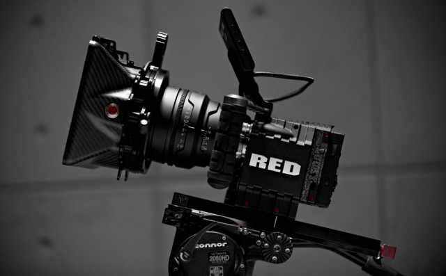
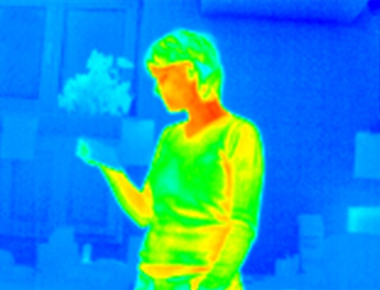

# Guide to Cameras for Interactive Installations

#### Original Text by [Blair Neal](http://blairneal.com) in 2013 with major update in 2020 (update in progress)

[GOOGLE DOC FOR CAMERAS](https://docs.google.com/spreadsheets/d/1zM1VhLzEeqW-6vP7xw6DVx-RA1b90rNA8ZxfCAxu-qw/edit#gid=0)

To-do for 2020 Update:

- Clean up language and links
- Publish a version to Medium?
- Update references to various camera technologies in all categories
- Reference different connection protocols now available or more common (HDMI Capture, NDI, IP Cameras, GigE)
- Webcam update technologies (Logitech Brio)
- Other RGB Cameras (PTZ, 4K, DSLR, Broadcast)
- Major depth camera update (Kinect Azure, Orbbec, Realsense, include [Stimulant Depth camera shootout link](https://stimulant.com/depth-sensor-shootout-2/), [GigE Realsense](https://imaging.framos.com/cpc/en/d435e/?keyword=Realsense+GigE+Camera&gclid=EAIaIQobChMIsqmywIPU5wIViJOzCh2NZQYsEAAYASAAEgIg7fD_BwE)   
- Thermal camera update (portable cams, USB, cheaper)
- High Speed cameras (Edgertronic, ix cameras, phantom)
- Others? (Leap Motion, GoPro, motion capture systems, things like Blacktrak(https://blacktrax.cast-soft.com) ), other things to consider as cameras or "observational tracking devices"
- Older camera technologies (DVCam, RCA/Analog, "Analog" capture devices, etc)
- Experimental
- Wireless/Drone?/Teradek
- Maybe more general tips outside of specific camera technologies? Suggestions below from Elliot
- Monochrome advantages
- USB3 vs GigE
- Lenses
- Noise and Noise reduction
- Machine learning touchup (upscaling, noise reduction, low light)
- Using a smartphone camera (pros, cons, intgerated sensor data and intrinsics)
- High end machine vision cams

-------------------

**Preface:**

I published this guide in 2013 on [Creative Applications](http://creativeapplications.net) and moved it to Github in 2016. I don't think the Kinect 2 was out at the time, and many other cameras have since come and gone. Camera technologies have obviously changed a lot in the 7 years since I published, so it is certainly time for a major update. The 2013 version is being kept in the repository for historical reference.

Major changes to this since 2013 are that a lot of technologies have come out, HDMI capture is a lot easier and cheaper than it was in 2013, and Machine Vision algorithms have been able to accomplish things with object and body recognition that didn't even seem possible 7 years ago. I'm also covering a slightly broader set of cameras than I did in 2013 for completeness.

-------------------

If your work involves interactive installations, there's a good chance you'll be working with a camera at some point. Choosing the right type of camera for your interactive installation is one of the most important technical choices you can make in the initial planning phases of your project. You can always correct for certain things in software, but your hardware and camera choices are the first line of defense against undesired behavior. 

In the sections below, I will cover several topics including common and uncommon camera types that are used for interactive installations, and their strengths and weaknesses. Here is an outline of what is covered:

 - Questions to consider when choosing a camera
 - The Basic RGB Webcam
 - Other RGB Cameras
 - Infrared Cameras
 - Depth and Stereo Cameras
 - Thermal Cameras
 - High-end machine vision cameras
 - High-speed or Slow Motion Cameras 
 - Wireless cameras
 - Motion capture systems
 - Other cameras and systems (robotic/Moving and other observational tracking devices)
 - Older Camera/Video Technologies (Analog, Old RCA Cams)
 - Experimental Technologies
 - Camera interfaces (USB 2 and 3, HDMI, NDI, IP, GigE, etc)
 - Outdoor considerations
 - Notes on Lenses
 - Notes on Latency
 - Notes on image touch-up and noise
 - Brief software discussions
 - Other References and Acknowledgments

##Questions to consider when in planning phases:

Before we dive in, consider the following questions when considering which camera best suits your use case. You don't need an answer for everything, but having an idea for many of these will help determine the strengths and weaknesses of various technologies and help narrow down your list.

- Do you even need a camera? Would another sensor work better or be more reliable? Sometimes cameras can introduce a lot of unnecessary complexity where a simple distance sensor or physical button would be simpler.
- Where is the camera being set up? Does it need to be hidden?
- Will the camera be outside and exposed to the elements, or in the presence of direct sunlight?
- What is the lighting control like in the space? Does the space lighting change throughout the day or year?
- How precise does the interactivity need to be? Are you tracking large motions or small ones?
- Do you need more than one camera to cover the space? How will you combine or map the various camera images together?
- How will you run a cable from the camera to your computer? Will cable length be an issue?
- Is your software compatible with your choice of camera?
- Does the camera have settings that you can manually control or will it adjust itself automatically? If you need to control the settings automatically, does the camera allow for that?
- Do you need a high quality live feed image that the visitor will see, or can you get by with low resolution for tracking purposes?
- Is there a lot of movement in the space or in the background? How will you control for that?
- What is your subject? Are you tracking people or objects? Is there a controlled and defined space for interaction (i.e. a tabletop or a "stand here" floor sign), or is it more freeform?
- How big is the space you're trying to track people in? Where is the "active" area?
- Do you need to record audio as well? How do you plan on syncing a (potentially) separate microphone?
- Do you need a variable field of view (FOV), or is a fixed image fine? If necessary, can the image be zoomed or cropped on site?
- If necessary, how are you lighting the scene? What kinds of artificial lights will need to be tested and integrated into your setup?

----------------
##1. The Basic Webcam - RGB

[image source](http://www.flickr.com/photos/designios/2066516480/)

Even now, webcams are still great for basic applications and workspace testing, but are only occaisionally used for professional installations. Now that high quality cameras are built into almost every laptop and smartphone, the market for standalone webcams has largely stagnated since the mid 2010's. There are only a handful of decent options in this space and there doesn't seem to be a lot of choice or competition that will shake up the market anytime soon. 

A lot of the cameras available are really made for streamers and boast features for things like built-in AI face detection for autofocus (something that you may or may not even be able to use in your software). At this point, the [Logitech Brio 4K](https://www.logitech.com/en-us/product/brio) is probably the best option, and even that camera came out in 2017. At a quick glance, Logitech is basically the only name brand in the game at this point, other than a random mix of Chinese manufacturers.

**Connection types:** USB 3.0 and USB C is most common connection you'll see, but there are still some USB 2.0 connections out there.

**Max resolution range (typical):** 640x480 to 4K. This value ranges a lot, and it depends on your application. There are only a handful of 4k webcams out there, but there are a lot more 720p60fps cameras on the market these days due to the adoption of USB 3.0. If you're working with an older camera, USB 2 often does not have enough bandwidth to send 30fps worth of 1080p without some artifacts. Some web cameras are also guilty of doing some software compression of the image before sending it through the hardware connection, and this can add some image degradation.

**Webcam Pros:**

- Cheap! -  the best widely available ones I've seen are around $80 to 200 bucks, but you can get them for as low as $10 at this point
- Easy to find
- Reliable - leave them on for months (not always though!)
- Full color image - they can see just about everything you can. Some can see some IR wavelengths. Rarely will you actually need the color image since most commonly used CV algorithms at the moment use monochrome images.
- Widely supported by just about any software environment, and well understood.
- They can see projection and content on screens. Essentially they see a less dynamic/contrasty version of what you see with your own eyes.

**Webcam Cons:**

- They can see projection and content on screens.
- Some brands will have really poor image quality, especially in low light.
- Excessive image noise can severely impact tracking algorithms, especially in low light.
- Rarely do you get the option to manually change the settings of the camera itself from within your software without a little bit of specialized code or access.
- They typically have a fixed lens (no zooming or manual focus), but manual ones do exist
- Sensitive to changes in daylight/natural light
- Requires fairly sophisticated computer vision algorithms to extract really meaningful information from these cameras - no skeleton tracking or easy depth information
- USB cable lengths can be limiting if you need to be extremely far away from your processing computer. Plan for extenders/repeaters if going much over 30ft (10m) away
- Latency can sometimes be an issue with these. Not too much, but enough to feel just a little bit behind real life. Analog is a little bit faster in regard to processing the image. Also most of them, aside from the PSEye tend to max out at 30fps, and 60fps is really recommended for a lower feeling of latency and high tracking accuracy.
- Some cameras have weird methods of autofocus that can really screw up your imagery. I've used a few that were nice HD cams, but the slow hunting autofocus made them a deal breaker.
- Try leaving your camera on for an extended period of time. I've seen issues with inexplicable strange coloring, and just non-responsiveness after being left on for a long time with certain brands.

**Range of effectiveness:** Varies by placement. Could watch an entire room of people, but with very little precision. Seems to work best in a range of about 1ft-50ft (.3-16m). If you're too far back, it can be difficult to get an accurate  or meaningful reading because the people will be too small to the sensor in relation to other image noise. Can be fine if they are on a fairly plain background though.

**Optimal environment for repeatability/reliability:**

This is one of your only options on the list that is able to see the full color range, so you're sort of stuck with this or the pricier options in the next spot if you're doing any tracking that plans on using the colors in your environment.

Ideally a controlled room with good artificial lighting and no windows will ensure this camera will react the same at any hour of the day.

Most simple tracking methods with this camera will work best when the subject is on a plain solid background so it is easy for your software to pick out a person from other objects in the space. Background subtraction is suggested in a case like this.

**Troublesome environments:**

An environment with a lot of changing daylight or natural light can really impact this camera's ability to reliably and predictably track at all hours.

A room with none or very little light will pose a lot of issues for getting reliable readings from this camera.

Rapidly changing lights or flashing projection in a space can sometimes upset their calibration.

**Webcam Further reading (some of these links are for older systems):**

Other good webcam sources:
[ECon Systems](https://www.e-consystems.com) - lots of custom options and lensing

Check out the differences between a UVC cam and a non UVC cam to get an idea about if you'll be able to manually control the camera from within your software. Check out UVC camera control for macOS [here](http://phoboslab.org/log/2009/07/uvc-camera-control-for-mac-os-x)
[Focal Length Calculator](http://www.videologyinc.com/lens%20focal%20length%20calculator.htm)
[Spreadsheet of different webcams and their capabilities for manual control on macOS](http://mactaris.blogspot.nl/p/webcam-settings-camera-support.html)
[Vidvox](https://vidvox.net/rays_oddsnends/VVUVCKit_doc/) has a UVCKit app/framework that may allow you to control various settings of your MacOS cam via UVC

--------------------
##2. Other RGB cameras

###### [Image source](http://www.brainfarmcinema.com/red.aspx)

Webcams can only go so far in terms of quality. There are various reasons for wanting something in this category. and it usually comes down to needing really high quality and high resolution images at a very low latency. You may also be working with some unusual equipment, capturing input from another computer or image device that isn't a camera or have some other concerns about image input. There are still a ton of things you can do with analog cameras that you simply cannot do yet with all digital setups.

These cameras tend to have the same qualities/pros/cons as the standard webcam does. There are just a few important differences in certain use cases.

Beware of interlacing from analog capture devices. Tracking algorithms will not be a fan of that. Also be aware of anything involving [NTSC versus PAL](https://www.wisegeek.com/what-is-the-difference-between-ntsc-and-pal.htm). You will be able to capture at a higher resolution and full frame rate, sometimes up to 60fps (or higher!) and 1080p and beyond, but that comes at a hefty price tag and will consume a large amount of computational resources. Some capture tools let you do full 4K resolution preview monitoring, but these occasionally need their own software pipes to get something that big into your processor. Check out this &lt;a href=">Black Magic 4K Ultra Studio</a> for an option for getting 4K input.

There are some fantastic options for getting HDMI/SDI input into laptops now via thunderbolt connections, like the <a href="http://www.blackmagicdesign.com/products/ultrastudio/">Blackmagic Ultrastudio</a> or <a href="http://www.blackmagicdesign.com/products/intensity/">Blackmagic Intensity</a>. These capture devices won't always work if you're sending signal from another computer though, so check your video color formats first for compatibility.

Capturing with a <a href="http://www.amazon.co.uk/s/?_encoding=UTF8&amp;camp=1634&amp;creative=19450&amp;field-keywords=DSLR%20cameras&amp;linkCode=ur2&amp;rh=i%3Aaps%2Ck%3ADSLR%20cameras&amp;tag=creativenet-21&amp;url=search-alias%3Daps" target="_blank">DSLR</a> all day would be great because you'll get the best image for the price range, but those cameras are not always designed to be left on for extended durations. DSLR's can easily suffer from heating issues or auto-shutoff if left on for too long. A more robust production camera or a solid DV Cam is more ideal for long running installations that require a really good image (and can't use a webcam for whatever reason), but make sure to do a lengthy test run before installing. Note: if tested and implemented with care, some DSLR's can perform just fine for long installation runs (one person has mentioned one running for 6 months at 7 hours a day with no issues).

DSLR's may need their SDK and some software massaging to work correctly in your environment, although some offer hit or miss HDMI output that would require a capture card. Canon's EDSDK for example has been <a href="https://github.com/kylemcdonald/ofxEdsdk">ported</a> to openFrameworks for easy access, and <a href="http://blairneal.com/blog/canon2syphon-v1-0&gt;&lt;/a&gt;Canon2Syphon&lt;/a&gt; will let you access the camera feed in other video apps via Syphon. You can also play with custom firmware for Canon to expose additional features with the &lt;a href=">Magic Lantern Firmware.</a>

Other high end cameras also enjoy the benefits of working with cables that were designed with long cable runs in mind. Webcams over really long (10m/30ft+) USB cables can cause jitter or some other funky consistency issues, so again...test before installing whenever possible. Production quality cameras can work over HD-SDI for fairly long runs (around 200-500ft depending on who you ask), but for the really far stuff, you're best either going over a network if you don't mind latency, or going over fiber with a converter box. Fiber will get you considerably further, more than 2500ft if you need it. You'll also need a capture card for some of these, occasionally requiring a tower instead of a laptop. Adding length in almost any case is going to add to the potential for problems, so if it is something going over 200 or more feet, try to check your whole chain first.

You're sometimes limited by the capture device and its support on your intended system. Some capture devices need special drivers or other magical mysticism to work within your intended environment, so be warned before going down this path...save your receipts.

**Further Reading:**

<a href="http://frieder-weiss.de/eyecon/equipment.html">Frieder Weiss's writeup on using digital versus analog cameras and the latency issues involved</a> - 2008)

--------------
##3. Infrared Cameras

These are really an essential tool for anyone working with interactive installations. Our visible light goes from 400-700nm, but certain cameras have the ability to see from 700-1000nm. This allows you to hide tracking lights (IR LED's or IR floodlights) and do other tracking of things not visible to the human eye.

The <a href="http://www.amazon.co.uk/dp/B000W3YQ1Y/?tag=creativenet-21" target="_blank">Playstation Eye</a> is sort of the go-to for a lot of these applications (it's used in projects like the <a href="http://www.eyewriter.org/">Eyewriter</a>) because it does 60fps (or higher!), has a range of lenses you can buy, and it's pretty cheap for the quality. <a href="http://createdigitalmotion.com/2009/08/trick-out-your-ps3-eye-webcam-best-cam-for-vision-augmented-reality/">Read more about it here</a>. It will need to be modified and requires a visible light filter to only get the IR bands. It is also a great option as a regular RGB cam since it has variable focus and you can <a href="http://peauproductions.com/store/index.php?main_page=product_info&amp;products_id=2">buy extra lenses</a> for it to get wide or narrow angles.

For the next level up, the other common one is the <a href="http://www.ptgrey.com/products/fireflymv/fireflymv_usb_firewire_cmos_camera.asp">Point Grey Firefly</a>. One tip for this one is to go ahead and buy only the monochrome version of this camera, as the color version has the additional color filter layers that can impact image quality and response. I stick with the firewire version of this camera for the bandwidth, but that can limit you on cable length (you can really only get firewire out about 10-15ft without using a repeater or amplifer, so keep that in mind when building equipment lists). The Firefly will also take a range of lenses that give you an insanely large aperture of around 1.4-1.2f and will be able to give you a much brighter image than a standard webcam. You WILL need a visible light filter for the Firefly to only get IR bands though. See Golan Levin's article on <a href="http://www.flong.com/blog/2010/a-brief-note-on-infrared-filters-87-vs-87c/">choosing the right IR filter for your application</a>. In addition to the Point Grey, you can check out these cameras from <a href="http://www.theimagingsource.com/en_US/products/cameras/">Imaging Source</a>.

When choosing these higher end cameras, also make note of their sensor size. A larger sensor will potentially increase your output resolution and decrease sensor noise, but you are left with a smaller range of lens choices. The happy medium seems to be a 1/3" sensor with a CS mount for the widest range of options.

**Connection Types:** USB 2 (Playstation Eye or another webcam - modified), USB 3 (Point Grey Flea 3), Kinect's IR cam, Composite/Firewire (old Sonycam's with night vision)

**Resolution Range:** You can generally get the same resolutions in IR that you can in regular webcams. There are plenty of tutorials out there for modifying standard webcams to only process IR light.

**Range of effectiveness:**Generally the same as a webcam (1ft-50ft or .3-16m). Some IR cams like the Point Grey have a wider range of security camera lenses for various zoom ranges if you need to do tracking from far away.

**Infrared Pros:**

- They cannot see images that are projected or on a screen (some can see content on screens...depends on screen type). IR and projection are a really nice interactive match, but you tend to need a dark space to pull these off. Are you also tired of being relegated to a dark windowless room with these tools?
- Can be used in dark spaces when used with IR emitters.
- Since they can see what the human eye can't, they are most useful for hiding certain elements like lights used for tracking points or illuminating a space.
- Tracking a point of IR light is an incredibly effective and robust tracking method because you can have a bright point of light that is invisible to the human eye.
- Good for tracking a large area like a stage flooded with IR.

**Infrared Cons:**

- Monochrome
- They require a healthy source of infrared light. Don't assume the lights inside will provide the type of light these cameras need to see effectively. You may need IR emitters to properly illuminate the space. People wont be able to see the extra light, but the camera will.
- Sensitive to sunlight and certain stage lights. Some stage lights will be bright enough to throw off tracking on an IR camera because the range of the light and camera overlap enough. There may be problems that the camera can see that you might not have seen with your eyes, so it can be useful to know the complete light profile of a room or to just go there with a camera beforehand.
- Certain clothes and materials look different in IR than in visible light. Can have weird effects sometimes.

**Optimal environment for round the clock reliability**

Room with a steady amount of IR light, either artificial or coming from a point source. Undesired sunlight can blow out an IR cam if the aperture isn't set right or if it doesn't have an automatic adjustment.

**Troublesome environments**

A dark room with insufficient IR light. A lot of normal light bulbs will still show up in IR even if they don't put out enough light to illuminate the IR spectrum, so keep an eye out for those in the background as pesky tracking distractions.

**Further Reading for IR cams**

<a href="http://frieder-weiss.de/eyecon/infrared.html">Frieder Weiss's writeup on IR cameras and equipment</a> -2008

**Other IR camera suggestions:**
Cheap Infrared CCTV cams work well, but you'll need a capture device
<a href="http://www.supercircuits.com/security-cameras/2-megapixel-hdcctv-box-security-camera-hdmi-blk-hdc20&gt;Full HD over HD-SDI or HDMI (needs filter!)&lt;/a&gt;&lt;br /&gt; &lt;a href=">Sony CCTV cam good in low light (needs light filter)</a>
The Sony M183 or M383 are classic low latency cams used for IR sensing, but are now discontinued, but check eBay.

---------------
##4. Depth Cameras

(<a href="http://web.mit.edu/newsoffice/2011/lidar-3d-camera-cellphones-0105.html" target="_blank">image source</a>)

In a way, these are an offshoot of the IR camera category but they involve some form of infrared light projection that gets reassembled as a depth image using a variety of techniques like time-of-flight (TOF) or structured light. These two detection methods are pretty different and have their own pros and cons, in terms of potential speed: <a href="http://www.computervisiononline.com/books/computer-vision/time-flight-cameras">read about their differences here</a>.

The information that comes back in a depth image is much richer than the usual "2D" image captured by the cameras above, and it gives you the ability to more easily and robustly detect things like hands and fingers. Tracking those features would be difficult and require very controlled conditions with just a monochrome 2D image. The depth information makes it easier for you to detect the difference between a person and the background, and therefore assign more meaningful information to the human trying to interact. This is why it is easier for the Kinect to give you a person's skeletal information, something that would be difficult for just a regular 2D IR image.

<iframe src="http://www.youtube.com/embed/7QrnwoO1-8A?rel=0" width="640" height="480" frameborder="0" allowfullscreen="allowfullscreen"></iframe>

There are also other methods of obtaining the same information with a high framerate webcam and a projector (structured light). Another method called <a href="http://en.wikipedia.org/wiki/LIDAR">LIDAR</a> scanning uses lasers and a method of measuring the reflected light to construct a high resolution depth image. LIDAR is usually more effective than other methods at measuring an incredibly large area or the front of a building (for quickly getting a 3D model of the facade for a projection mapping surface).

**Connection types:** Primarily USB2 (<a href="http://www.amazon.co.uk/dp/B0036DDW2G/?tag=creativenet-21" target="_blank">Kinect</a>,<a href="http://www.amazon.co.uk/dp/B005UHB8EK/?tag=creativenet-21" target="_blank"> Asus Xtion</a>, <a href="http://www2.panasonic.biz/es/densetsu/device/3DImageSensor/en/index.html">Panasonic D-Imager</a>, <a href="http://click.intel.com/intelsdk/Creative_Interactive_Gesture_Camera_Developer_Kit-P2061.aspx">Intel/Creative Time of Flight cams</a>), other interfaces in more research oriented/industrial cameras.

**Resolution Range:** This mostly tends to top out around 320x240 @30fps for the more consumer level cameras, mostly for TOF. TOF cameras use different sensors than standard CMOS cams which impacts their speed and resolution. The Kinect is faster and higher resolution because they just use a standard IR cam.  Check the individual camera for it's maximum resolution.

**Range of effectiveness:** Typically less than 10-12ft ( 3-4m).  Some cameras like the Intel/Creative TOF camera are really only designed for desk use and give you about 1m of effective distance, if that. Other TOF cameras like the D-Imager can give you up to 10m of range though. Makes certain sensors not very robust for use on large stages. Requires multiple sensors to cover a large area and thus complicates the CV processing chain and hardware setup. LIDAR can do a large area, but not necessarily in real time.

**Depth Camera Pros:**

- Depth images give you the option of really amazing background subtraction because you can totally ignore everything beyond about 10ft (with a Kinect).
- Processed depth images give you a lot of great tracking information like hand skeleton, body skeleton, shape normals. You can build 3D models of rooms or objects. You can do fairly high quality body and facial motion capture for use in 3D rendering programs.
- Isn't affected by light from a projector. A lot of the same good qualities as standard IR, but they should only be used if you <em>need</em> depth information...they are not preferred over regular IR. Again, do your best to choose right tool for the job.

**Depth Camera Cons:**

- Because of the use of IR, these cameras will also be sensitive to changes in sunlight.
- Do not rely on depth cameras if you need a sharp, clean outline of your subject. You will get jagged artifacts that will need to be blurred or processed to get smooth lines.
- Structured light cameras aren't able to work at an incredibly close range (ie right in front of them). Time of flight cameras are a little more robust in this regard, and are better if you need to use them really close up.
- Certain surfaces will interfere with the ability to produce a good depth image. Shiny surfaces will effectively be invisible or cause strange reflection artifacts in your image.
- Using multiple systems together occasionally requires special consideration. Overlapping structured light from the Kinect (if they are right next to each other) can cause double images to appear due to the extra light grid. If the Kinects are more perpendicular to each other, this negative effect is less likely. You can also use this trick: attach a vibrating motor to one Kinect to make the other sensor's dots blur, and the vibrating sensor's own dots will stay in focus.
- Fairly limited effective range.

**Depth Image Examples:**

LIDAR/Structured light was used to get the massive scans of the spaces in this Radiohead video for House of Cards:

<iframe src="http://www.youtube.com/embed/8nTFjVm9sTQ?rel=0" width="640" height="480" frameborder="0" allowfullscreen="allowfullscreen"></iframe>

**Further reading:**

If you're just looking for stereo vision capture that can infer depth info, check out the <a href="http://www.ptgrey.com/products/bumblebee2/bumblebee2_stereo_camera.asp&gt; Point Grey Bumblebee &lt;/a&gt;&lt;/p&gt; &lt;p&gt;&lt;a href=">Readings on structured light and how it works</a>

--
##5. Thermal Cameras

<small>(<a href="http://www.humintell.com/2011/09/truthfulness-detection/thermal/" target="_blank">image source</a>)</small>

<a href="http://en.wikipedia.org/wiki/Thermographic_camera" target="_blank">http://en.wikipedia.org/wiki/Thermographic_camera</a>

These cameras are comparatively rare to see in use in interactive installations because they are still prohibitively expensive compared to most other ones. They aren't totally unobtainable ( roughly $1000-20000) but that higher price tag makes them a little less desirable for early exploration on projects. It's a shame because these cameras offer a lot of abilities that just aren't possible with the other kinds of cameras.

There are various types of cameras to look at in this class, mostly pertaining to which part of the IR spectrum you're trying to see. You have the option of Long Wave IR, Mid Wave IR, and Short Wave IR. For thermal imaging, you'll mostly want to work with Long Wave IR, in the 7000-14000nm range.

I have not personally used one of these cameras yet, but they have some properties that would be really amazing in the tool belt of people making interactive installations.

Check out this guy doing some random demos with a thermal camera:

<iframe src="http://www.youtube.com/embed/6mV4ecEbV1s?rel=0" width="640" height="480" frameborder="0" allowfullscreen="allowfullscreen"></iframe>

**Connection types:** Most are made to be integrated into existing systems and either have proprietary connections or just output composite video. <a href="http://www.thermitrack.com/">Some cameras communicate X/Y position of blobs.</a>

**Resolution range:** Some are very low resolution (the Thermitrack is 16 x 16px) and some are close to a VGA range, but don't expect to find HD thermal for cheap. You also get a variety of frame rates and contrast ranges.

**Thermal Camera Pros:**

- Normal visible light doesn't have much of an effect on a thermal camera.
- Good for tracking a large area like a stage.
- Gives you the ability to more definitely identify people because of their heat signature...whereas other objects and materials may not show up at all if they are warmer.
- Fairly robust for daytime to night time interaction because people will be the same temperature and appear in the proper dynamic range.
- Give you the ability to track invisible phenomena like hot air from breath, or residual heat from something like a hand leaving a warm mark on a surface, or a cold blast of water hitting a warm surface.
- Can see through certain materials and walls.
- Thermal cameras can see through certain kinds of clothing.

**Thermal Camera Cons:**

- As these are occasionally considered military grade equipment, there may be export restrictions, so be wary when planning on traveling abroad.
- Expensive
- Difficult to integrate - require either custom electronics or capture hardware
- Thermal cameras can see through certain kinds of clothing.
- Not all lights are invisible to thermal cameras...if it's producing heat or radiating it, the camera will see it.
- Thermal imaging sometimes results in ghosting of movement due to the sensor method.
- They are unable to see through windows/glass because the range of radiation ends up being reflected before it transmits through the glass to the camera. <a href="http://answers.yahoo.com/question/index?qid=20081001100003AAH2Ouo">See here for a more involved explanation of why</a>.
- Certain hot materials may result in unforeseen difficulties with using thermal imaging in certain environments. Requires a different type of thinking in order to anticipate things that will be overly hot or cold in the space of the installation.

**Further reading:**

[People counters (wiki)](http://en.wikipedia.org/wiki/People_counter)"

[Thermitrack](http://www.dbpharrison.com/tag/thermitrack/)

##7. High End Machine Vision Cameras
These cameras are typically employed in industries like manufacturing that require a high degree of stability and performance for performing computer vision tasks. 

One example would be the use of cameras and specialized software to monitor a fast moving automated assembly line and using the visual data to ensure every product looks correct. They can also be employed for things like processing produce - sorting ripe tomatoes from green tomatoes at very high speeds.

This area of cameras is incredibly complex and we won't go into all of the specifics here, but you should definitely be aware that these specialized systems exist. The most common ones you will probably come across have already been mentioned, like machine vision infrared or thermal cameras. most of them range from having standard interfaces like USB and GigE, to proprietary cables and PCI cards for maximum data speed and low latency.

**Camera resources:**
[e-Con Cameras](https://www.e-consystems.com)
[Allied Vision](https://www.alliedvision.com/en/digital-industrial-camera-solutions.html)

##8. High-speed or Slow Motion Cameras

[High-speed Cameras](https://en.wikipedia.org/wiki/High-speed_camera) are a special class of cameras that can capture 250 frames per second or higher, even up to 250,000fps to several million fps in some cases. If the high-end machine vision cameras above are for real-time processing, I'm thinking of high-speed cameras more for offline recording and viewing - a slightly different workflow. High-speed cameras are fairly uncommon in interactive installations because the (current) limitations of physics mean you can't watch reality in real time and slow motion reality at the same time. Years ago, getting cameras that could capture higher than 60fps were fairly specialized and uncommon, especially for the consumer market. Now almost every flagship smartphone can record 120-240fps and sometimes even higher in burst modes. Some standard webcams can also get up to 120fps. The primary market for professional high speed cameras is for industrial purposes, like the high end machine vision cameras covered above, or for the film industry. Since these applications are fairly niche and low demand, these cameras tend to be incredibly expensive - ranging from around $500USD on the low end to $30,000USD to $50k+ on the high end.

High-speed cameras typically work by continuously recording a circular buffer of frames into specialized on-board memory. When the camera receives a trigger to begin recording, that circular buffer is dumped and encoded into a regular video file that can then be downloaded off the camera or played back directly on the device. Depending on the resolution, frame rate and compression type, these files can be quite large, and can take time to download off the camera to process with software. 

Another noteable thing to know about high-speed cameras is their light requirements. Because of the incredibly fast shutter speed, High-speed cameras require a lot more light than a traditional video camera. A traditional camera may only need to capture a frame every 1/60th of a second, while a high speed camera needs to capture a frame every 1/1000th of a second, causing a drastic reduction in the amount of photons hitting the image sensor. Filming outside in direct sunlight is usually the best option, but if you need to capture indoors you will need to use the correct type of light. Incandescent lights, flourescent lights, and other older styles of lights tend to not work for high speed because they actually flicker at a rate faster than the naked eye can see (typically at the 60hz of a standard AC power source). Using an incandescent light source with a high speed camera will often reveal the light dimming and brightening instead of staying steady. For high speed cameras, very large lights that can't cool down quickly enough to flicker or LED light sources for film production tend to be preferred. As usual, do your research on the light since not everything is created equal. [Here](https://www.lovehighspeed.com/lighting-for-high-speed/) is another source on lighting for high-speed filming.

Since high-speed cameras are really just great at pushing a lot of data through very quickly, youll find your tradeoff is usually between the desired resolution and your desired framerate. You can achieve very high framerates but at very low resolutions. These low resolution + high FPS videos can be useful for scientific work (like analyzing ballistics, for example) but not so much for providing a high quality clip for a user. 

Noteable high speed camera manufacturers are [Phantom cameras from Vision Research](https://www.phantomhighspeed.com), [Photron cameras](https://photron.com), and [iX cameras](https://www.ix-cameras.com), but their cameras can typically cost more than most interactive installation budgets can manage. Rental is often an option as well. The main issue you may run into with these cameras is actually interfacing with them. Because of their high cost and low usage in the interactive space, there often isnt a lot of prior knowledge out there about working with them and you need to have a camera before you can get documentation about their API's and such. Around 2014, [Edgertronic](https://edgertronic.com) entered the high-speed scene with their more affordable high-speed cameras. Edgertronic cameras are basically a specialized FPGA with a Linux computer for additional processing and control. I used several of these on an installation in 2014 for capturing footage of participants at 720p and 400fps and they performed fairly well and were easy to interface with via standard http requests and a browser interface. Several models have come out since then with various improvements. Most other cameras out there also interface via a network connection to some proprietary control software.

##9.  Wireless cameras

Wireless is a bit of a misnomer since almost any camera can be made wireless these days, and obviously even smartphone cameras count as a wireless camera. Smartphone cameras can be sent to desktop computers via various streaming apps. GoPro cameras are another classic consumer wireless camera. The primary application is for film shoots (monitoring, recording backups, etc) and specialized uses like mounting to a flying drone or other temporary applications.

Since wireless cameras are more about the interface that sends the image signal more than the actual image capture, there isn't a ton to cover here. There are a lot of devices out there for connecting any camera to a wireless interface that can stream the signal to a nearby computer over wifi, or over the internet via an integrated 4G/5G interface.

Professional Wireless camera interfaces to investigate include:
- [Teradek](https://teradek.com)
- [Paralinx](https://www.paralinx.net)
- [Vaxis](https://vaxis.us)

##10. Motion capture systems
These could have their own article and I have limited experience with them, but they are worth adding to the list for completeness.

##11. Other cameras and systems (robotic/Moving and other observational tracking devices, Security Cameras)

[Freefly](https://freeflysystems.com)

##12. Older Camera/Video Technologies (Analog, Old RCA Cams)

##13. Experimental technologies

##Camera interfaces (USB 2 and 3, HDMI, NDI, IP, GigE)
Another important thing to keep in mind is that while many artistically geared software environments do work off-the-shelf with various cameras and input types (typically with [UVC](https://en.wikipedia.org/wiki/USB_video_device_class), more exotic cameras aren't always plug and play. Make sure you do your research before making a big purchase. If the tool doesn't exist to pull in a video feed, there are a few technologies that can route video between applications or even over the network. The most common tools are [Syphon](http://syphon.v002.info) for macOS and [Spout](https://spout.zeal.co) for Windows, but there are other options out there as well.

##Outdoor considerations

##Notes on Latency

##Notes on Lenses

##Image touch-up and Noise
Low light, De-noising, upscaling

##References and Acknowledgments

[Advantage of monochrome cameras for accuracy over color images](https://maxmax.com/faq/camera-tech/debayer-study)
[How to Measure the latency of your webcam with openCV](https://www.dlology.com/blog/how-to-measure-the-latency-of-a-webcam-with-opencv/)
[DreamChip Cameras](https://www.atom-one.de/#atom-cameras)
[Netv2 video capture and overlay device](https://www.adafruit.com/product/4248)
[DepthKit](https://www.depthkit.tv)

Huge thanks to Elliot Woods for a ton of thoughtful suggestions on how to expand  the guide from its 2013 version. [Kyle McDonald](http://kylemcdonald.net), [Theo Watson](http://theowatson.com/), <a href="http://thesystemis.com/">Zach Lieberman</a> and <a href="http://www.flong.com/">Golan Levin</a> for some great additional tips to help round out some of the suggestions here.

