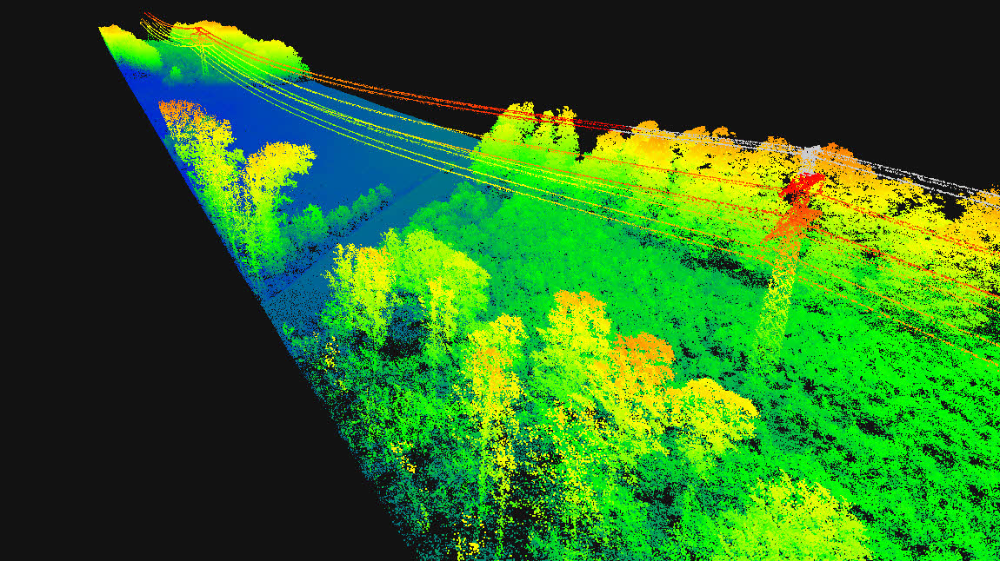
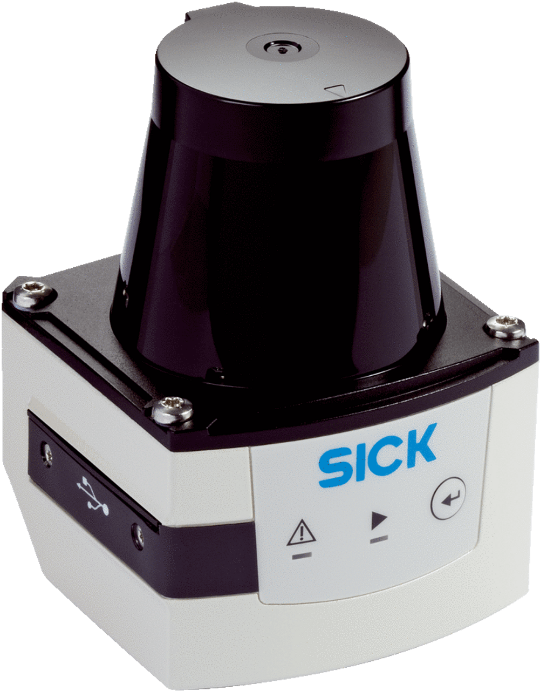

# LiDAR Scanners

## LIDAR

<figure><figcaption>
Example of long range LiDAR
</figcaption></figure>

<figure><figcaption>
Example of what many LiDAR scanners look like
</figcaption></figure>

[LiDAR Wikipedia entry](https://en.wikipedia.org/wiki/Lidar)

LIDAR is a specialized imaging technique that has some similarities to the depth cameras discussed previously. LIDAR stands for Light Detection and Ranging and it has many applications in various industries, but it has caught on as a technology for interactive installations in the last decade.

Suggested brands to investigate:

* FARO
* SICK
* Hokuyo
* Quanergy
* LIVOX
* Velodyne
* Ouster OS1 / OS0
* Intel L515
