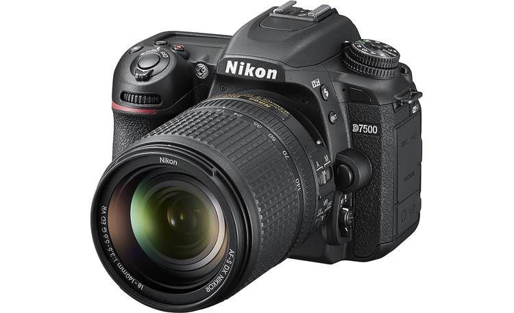

# Other RGB Cameras

## Other RGB cameras

<figure><figcaption>
Example of a DSLR camera
</figcaption></figure>

\[EDIT IN PROGRESS]

Webcams can only go so far in terms of quality and other features, so in this section we'll cover other types of RGB cameras. Choosing something in this realm usually means you need something with higher image quality, or lower latency, or higher resolution, or some other custom need. To put a finer point on it, I'm bucketing these types of cameras into this section:

* DSLR Cameras
* Mirrorless Cameras
* High and low end video cameras used for professional filming applications (ie camcorders, etc)
* Other basic cameras that can output over HDMI (action cameras like GoPro will be covered elsewhere)

Besides the increased price, the primary barrier to entry with these cameras is that they aren't as easy to plug in via USB and start working directly with the image, as with UVC webcams. Many cameras in this space either need a special driver or SDK that must be integrated into your software project. Cameras that don't have that option will typically output over some form of standard video cable like HDMI or SDI. HDMI and SDI can then be captured by specialized capture devices that can either be a specialized PCI capture card installed in a desktop, or they can connect over USB.

One of the most common ones types for interactive installations is the [DSLR](https://en.wikipedia.org/wiki/Digital\_single-lens\_reflex\_camera), usually chosen for its improved image quality over a standard webcam. DSLR's have become much easier to integrate over the last few years, but they still have some challenges depending on the particular model - those issues tend to be around connectivity and 24/7 reliability.

As for connectivity and control, many DSLR's have USB connections that allow for direct control via various methods. Most cameras require interfacing via their own custom SDK. For example, Canon has its own EDSDK that has been integrated into a few creative code environments in the past. Nikon and other manufacturers also have their own SDK's, but it may take some significant research on the best ways to integrate them into your software environment of choice. On top of capturing the image, many SDK's also allow you the ability to control the DSLR's settings via software. Direct control of exposure, white balance and other elements can be super important, depending on your application.

If USB isn't a suitable solution for capturing the image, or you don't need to have manual control over the camera's settings, the next option is usually to connect HDMI cables (usually micro or mini HDMI) to the cameras and then connect an HDMI capture device to your computer. Capture devices are covered in their own section later on, but I'll mention them briefly here. Typically a capture device connects to a computer over USB or some other high speed connection, or as a PCI capture card. They can range in price from [$20USD](https://www.amazon.com/Camcorder-Computer-Streaming-Broadcasting-Conference/dp/B08NYHLVX1/ref=asc\_df\_B08NYHLVX1/?tag=hyprod-20\&linkCode=df0\&hvadid=475750632217\&hvpos=\&hvnetw=g\&hvrand=12954617241411875882\&hvpone=\&hvptwo=\&hvqmt=\&hvdev=c\&hvdvcmdl=\&hvlocint=\&hvlocphy=9004351\&hvtargid=pla-1089390210901\&psc=1) to thousands of dollars depending on your need.

DSLR's are great for their image quality, but they were designed to be carried around and used intermittently. As such, they can occaisonally have heat or auto-shutoff issues when left on for extended periods. There are more cameras out there that have less issues with this these days, but 24/7 reliability is not an often published specification.

(Move this to the capture device section?) Other high end cameras also enjoy the benefits of working with cables that were designed with long cable runs in mind. Webcams over really long (10m/30ft+) USB cables can cause jitter or some other funky consistency issues, so again...test before installing whenever possible. Production quality cameras can work over HD-SDI for fairly long runs (around 200-500ft depending on who you ask), but for the really far stuff, you're best either going over a network if you don't mind latency, or going over fiber with a converter box. Fiber will get you considerably further, more than 2500ft if you need it. You'll also need a capture card for some of these, occasionally requiring a tower instead of a laptop. Adding length in almost any case is going to add to the potential for problems, so if it is something going over 200 or more feet, try to check your whole chain first.

You're sometimes limited by the capture device and its support on your intended system. Some capture devices need special drivers or other magical mysticism to work within your intended environment, so be warned before going down this path...save your receipts.

**Further Reading:**

[Frieder Weiss's writeup on using digital versus analog cameras and the latency issues involved](http://frieder-weiss.de/eyecon/equipment.html) - 2008)
