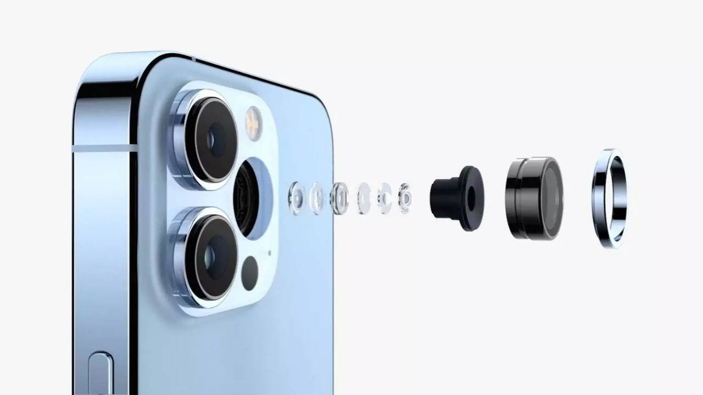

# Smartphone Cameras

## Smartphone Cameras

<figure><figcaption>
Render of an exploded view of a smartphone camera
</figcaption></figure>

I struggled with whether I should make smartphone cameras be their own section, or include them in the "Webcam" or "Other RGB camera" section. I think that the smartphone camera market varies so much from brand to brand that it's hard to generally cover. Additionally, each smartphone manufacturer has so much advanced image processing going on under the hood that it's almost more about the image processing than the light capture itself (one could argue that on-board image processing is also a major differentiator in the previous section as well).

On top of the above, another reason I hesitated to include this section is that - for a long time I would say that smartphone cameras were not the first device you would reach for for interactive installations. The most common application of a smartphone camera prior to 2016 would have been for tablet based photobooths and similar kinds of capture "stations", but not always as a source for other more involved experiences that integrate with technologies outside of the smart device itself.

One of the main reasons to include smartphone cameras as a common type now is primarily because of the massive improvements in Augmented Reality (AR) technology in the last few years. AR has a long way to go, but there are so many more AR based experiences that either loan out a device or ask a user to run an experience on their own personal device.
